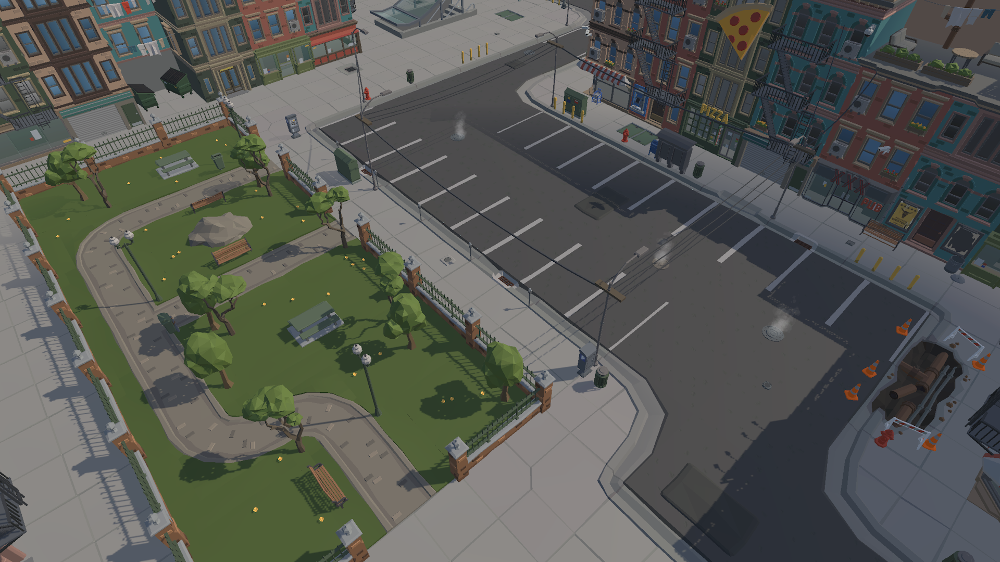
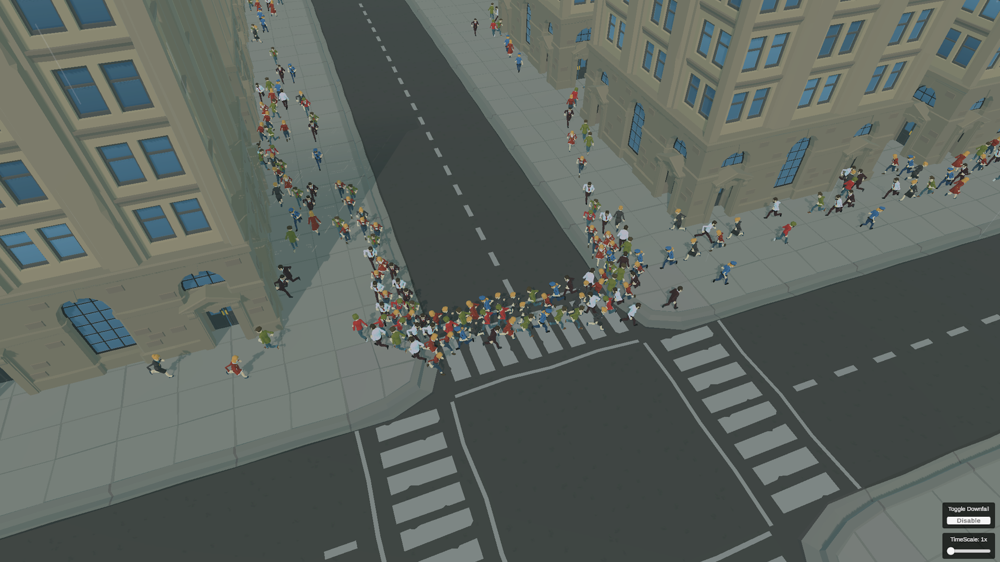
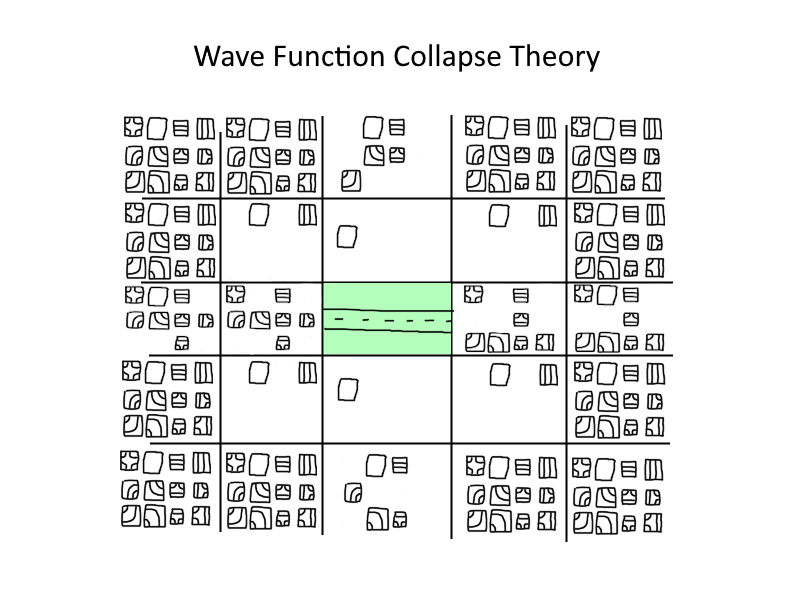
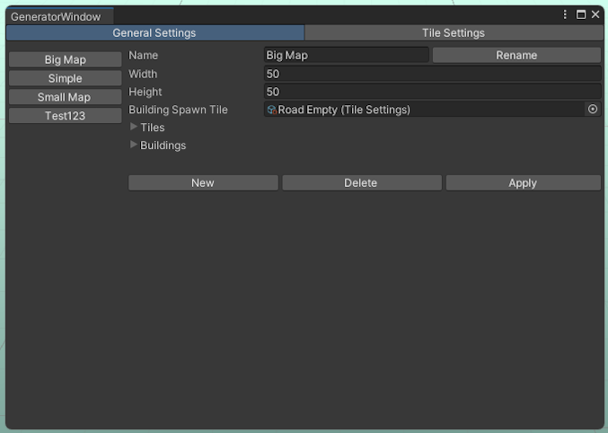
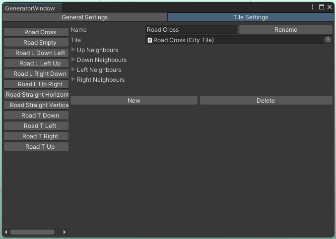
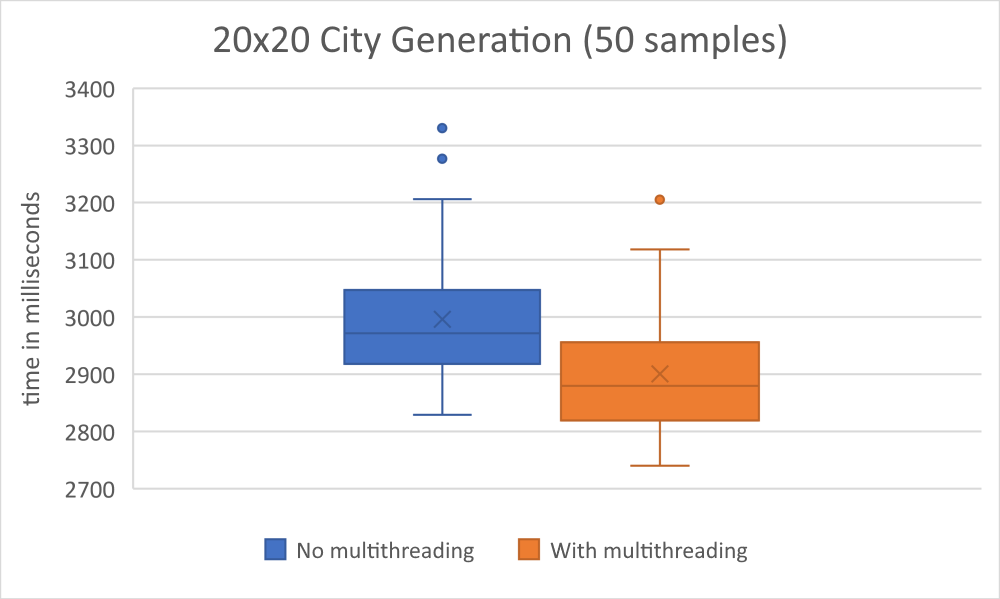
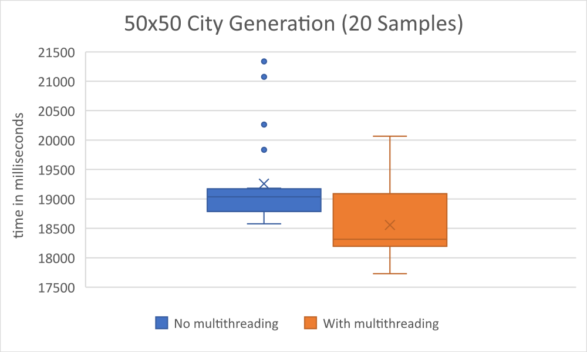
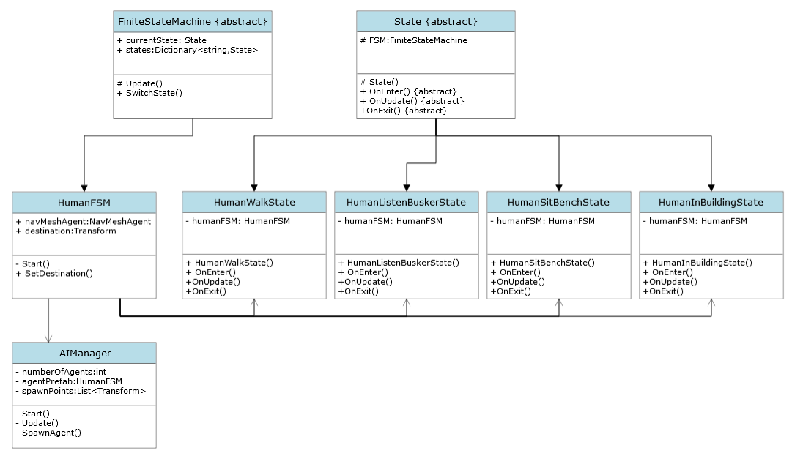
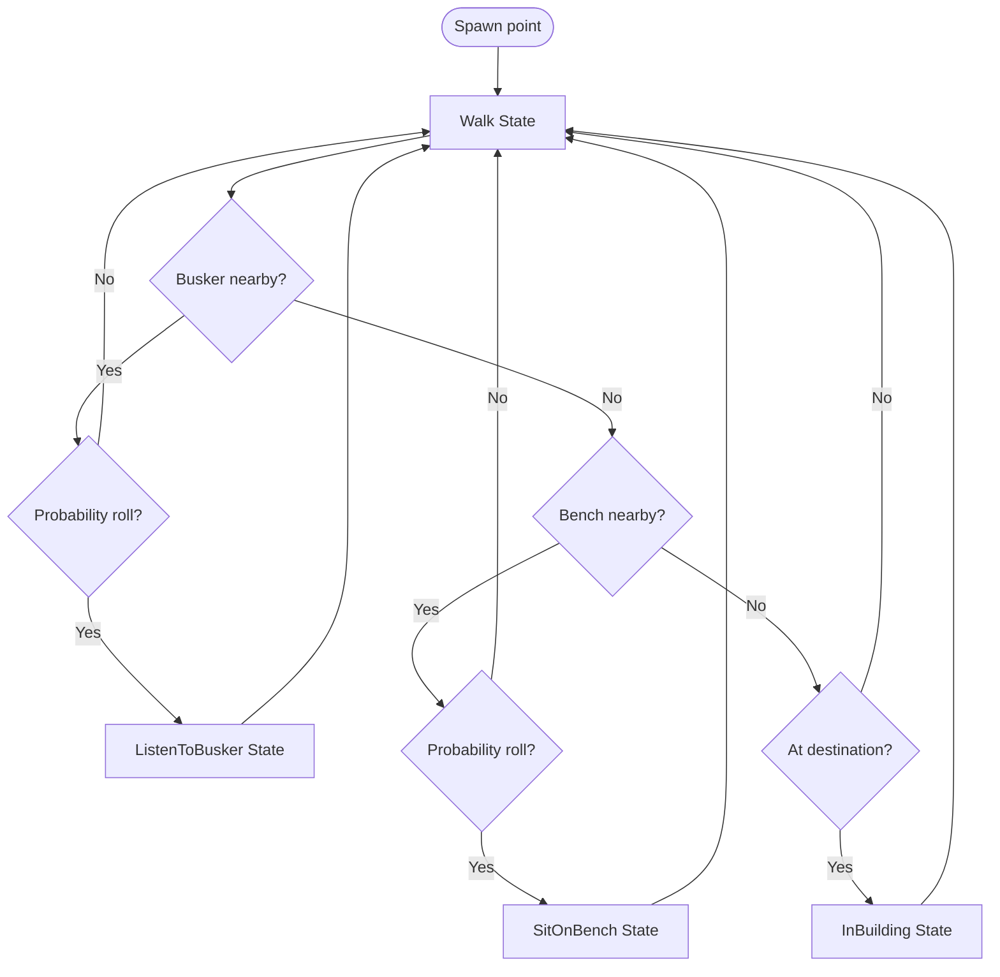

# City Simulator

| | |
| :---: | :---: |
|  |  |

A small Unity city that generates itself and fills with pedestrians who live their own little lives: walking to destinations, stopping to listen to a street busker, sitting down on a park bench, and hurrying indoors when it starts to rain.

This was my final project for the **Games Programming Diploma** at the SAE Institute (2023). It is a **learning project**: the whole thing exists so I could implement, and properly understand, two techniques from scratch: **Wave Function Collapse** for procedural generation and a **Finite State Machine** for agent behavior. Both are explained below.

- **Engine:** Unity `2021.3.21f1` (Universal Render Pipeline, C#)
- **Scenes:** `CityGeneration` (watch a city build itself) and `CityDemo` (a pre-built city populated with pedestrians)
- **Own code:** `Assets/Scripts` and `Assets/GameManager.cs`; everything else under `Assets/` (Synty POLYGON City, Quibli, TextMesh Pro) is third-party art/tooling used to make it look nice.

---

**What I built from scratch / learned:**

- **Wave Function Collapse** procedural generation, implemented from scratch and driven entirely by ScriptableObjects.
- A custom **Unity Editor tool** for authoring the tile set and its adjacency rules without touching code.
- A **Finite State Machine** driving pedestrian behavior (walking, sitting, listening, sheltering indoors).
- A **weather system** wired into the FSM via events, so rain visibly clears the streets.
- A **multithreading experiment** on the constraint propagation, benchmarked.

---

## Wave Function Collapse

Wave Function Collapse (WFC) is a constraint-based procedural generation algorithm. The idea, borrowed from quantum mechanics as a metaphor: every cell of a grid starts in a *superposition* of all possible tiles. You repeatedly "collapse" the most-constrained cell to a single concrete tile, then propagate that decision outward so neighboring cells drop any tiles that no longer fit. Do this until every cell has collapsed and you get a layout that is random but always locally consistent: roads connect to roads, corners meet corners, and no two identical cities appear twice.

My implementation lives in `Assets/Scripts/Generation` and is driven entirely by ScriptableObjects, so the tile set and its rules can be changed without touching code.

### How it works here

1. **Build the grid.** `CityGenerator` (`CityGenerator.cs`) spawns a `width × height` grid of `CityCell`s, each 20 units apart. Every cell begins with the full list of possible `TileSettings`, its superposition.
2. **Pick the lowest-entropy cell.** `GetCityCellWithLowestPossibilities` finds the uncollapsed cell with the fewest remaining candidate tiles. Collapsing the most-constrained cell first keeps contradictions rare.
3. **Collapse it.** `CollapseCell` picks one tile from that cell's candidates, reduces the cell to that single tile, and instantiates the tile prefab.
4. **Propagate the constraints.** Each `TileSettings` declares which tiles are allowed to sit *above / below / left / right* of it (`upNeighbours`, `downNeighbours`, `leftNeighbours`, `rightNeighbours`). After a collapse, `UpdateCell` walks the affected neighborhood and, for every neighbor, intersects its current candidates with what the surrounding cells still permit, removing any tile that no longer has support in every direction.
5. **Handle contradictions.** If propagation ever leaves a cell with **zero** valid tiles, generation can't continue there. `ResetCell` locally "un-collapses" that cell and its immediate neighbors back to a full superposition and retries, a lightweight backtracking step.
6. **Repeat** until every cell has collapsed, then optionally scatter buildings on the designated building tiles (`SpawnBuildings`), bake a NavMesh, and hand off to the AI (`AIManager`).

Generation runs as a coroutine (one collapse per frame), so in the `CityGeneration` scene you can literally watch the city resolve itself tile by tile.


> **A note on the code:** tile selection during a collapse is currently a uniform random pick from the remaining candidates. The per-neighbor `probability` fields exist in the data model for weighting adjacencies, but the weighting itself was left as a `// TODO`, an honest edge of the learning project.



*A grid mid-collapse: most cells still hold several possible tiles (their superposition), while the highlighted cell has been reduced to a single tile.*

### The generator tool

To make the tile set editable without recompiling, I built a custom Unity Editor window (`Assets/Scripts/Editor/GeneratorWindow.cs`, under **Tools ▸ City Generator**). It edits two kinds of ScriptableObject:

- **`GeneratorSettings`**: the city `width` / `height`, which tiles are in play, the building prefabs, and which tile counts as a "building" tile. You can keep several presets and *Apply* one as the active configuration the game loads at runtime (from `Resources/GeneratorSettings`).
- **`TileSettings`**: a single tile, its prefab and, crucially, its **allowed neighbors in each of the four directions** (with a probability field per neighbor). This is where the WFC rules actually live; changing a tile's neighbor lists changes what the algorithm is allowed to build.

The window has tabs for general settings and per-tile settings, and can create, rename, duplicate, and delete these assets directly.

| Generator Settings | Tile Settings |
| :---: | :---: |
|  |  |

*Sketch of the tool's two tabs: Generator Settings (width, height, tiles) and Tile Settings (the allowed neighbors in each direction).*

### Multithreading experiment

Larger cities take noticeably longer to generate, roughly **3 seconds for a 20×20** grid and **~19 seconds for a 50×50**. The most expensive part is the neighbor-constraint propagation, so I tried to speed it up by offloading each neighbor update onto the .NET `ThreadPool` (`ThreadPool.QueueUserWorkItem` in `CityGenerator.cs`). I chose thread-pool work items specifically because they spin up and tear down in milliseconds, which suits the short, bursty nature of a per-neighbor update.

The honest result: it helped, but only a little. Across repeated runs the multithreaded version was about **3.3% faster on the 20×20** and **3.8% faster on the 50×50**, a real improvement, but far smaller than I'd hoped, and a good lesson in where the actual bottlenecks lie (and in the overhead of sharing a grid across threads).

| 20×20 generation (50 samples) | 50×50 generation (20 samples) |
| :---: | :---: |
|  |  |

---

## Finite State Machine

The pedestrians are driven by a **Finite State Machine (FSM)**: at any moment an agent is in exactly one *state* (Walk, SitBench, ListenBusker, InBuilding), each state fully owns the agent's behavior while active, and transitions move the agent cleanly from one to the next. This keeps behavior readable and easy to extend: adding a new activity is just adding a new state.

The code lives in `Assets/Scripts/StateMachine`.

### The core

- **`FiniteStateMachine`** (abstract `MonoBehaviour`) holds the current state and a dictionary of available states, ticks the current state every `Update`, and exposes `SwitchState`. On a switch it calls the old state's `OnExit` and passes the new state's `OnEnter` as a callback, so a state can run its cleanup and *then* trigger the next state's entry.
- **`State`** (abstract) defines the contract every state implements: `OnEnter`, `OnUpdate`, `OnExit`.
- **`HumanFSM`** is the concrete machine for a pedestrian. It builds its four states on `Start`, wires up a `NavMeshAgent` for pathfinding, and begins in the Walk state.

### The states

- **Walk**: heads to its current destination via the NavMesh; on arrival it transitions to *InBuilding*.
- **ListenBusker**: stands within a small arc around the street busker for 20–40 seconds, facing them, then returns to walking.
- **SitBench**: claims a free bench (benches are tracked so two agents don't share one), sits for 5–10 seconds, then leaves.
- **InBuilding**: hides the agent's model and disables its NavMesh agent to simulate being indoors for 30–60 seconds, then picks a new destination and re-emerges.

Agents don't decide to sit or listen on their own; trigger volumes (`AgentTrigger`) placed near the busker and benches fire `OnCollisionWithTrigger`, which rolls a probability (configurable on `AIManager`) to decide whether the passing pedestrian diverts into that state.

### Weather ties it together

`WeatherManager` toggles rain across the city (and a URP color-grading shift) and raises an event when the weather changes. The FSM listens: when it starts raining, pedestrians switch to a run animation and hurry off the benches and away from the busker toward the nearest building, so the streets visibly empty out during a downpour.


### UML class diagram

The class relationships between the FSM, its states, and the surrounding managers:



### Pedestrian state flow

The decision flow a pedestrian runs through each time it reaches the Walk state:



---

## Project layout

```
Assets/
├─ Scripts/
│  ├─ Generation/          # Wave Function Collapse (CityGenerator, CityCell, ...)
│  ├─ ScriptableObjects/   # GeneratorSettings, TileSettings: the tile rules
│  ├─ Editor/              # Tools ▸ City Generator window
│  ├─ StateMachine/        # FSM core + Human states + AI/agent management
│  ├─ Camera/              # RTS-style pan / rotate / zoom (new Input System)
│  ├─ Utility/             # generic Singleton<T>
│  ├─ WeatherManager.cs    # rain + weather events
│  └─ UIManager.cs         # timescale slider, rain toggle
└─ GameManager.cs
```
